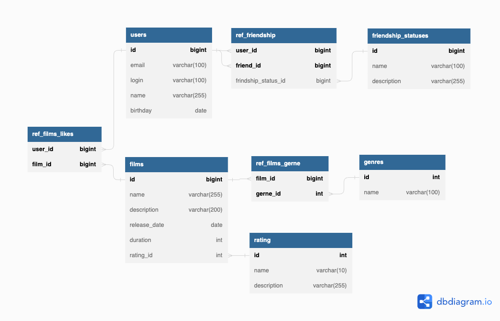

# java-filmorate

## Модель базы данных


### Описание таблиц БД
#### Таблица users
Таблица с информацией о пользователях приложения

| Название столбца | Тип данных | Обязательность | Nullable | Описание                                         |
|------------------|------------|----------------|----------|--------------------------------------------------|
| id               | bigint     | +              | -        | Уникальный идентификатор записи в рамках таблицы |
| email            | varchar    | +              | -        | Адрес электронной почты пользователя             |
| login            | varchar    | +              | -        | Логин пользователя                               |
| name             | varchar    | -              | -        | ФИО пользователя                                 |
| birthday         | date       | +              | -        | Дата рождения пользователя                       |

#### Таблица films
Таблица с информацией о фильмах, которые доступны в приложении

| Название столбца | Тип данных   | Обязательность | Nullable | Описание                                         |
|------------------|--------------|----------------|----------|--------------------------------------------------|
| id               | bigint       | +              | -        | Уникальный идентификатор записи в рамках таблицы |
| name             | varchar      | +              | -        | Название фильма                                  |
| description      | varchar[200] | -              | +        | Описание фильма                                  |
| release_date     | date         | +              | -        | Дата релиза фильма                               |
| duration         | int          | +              | -        | Продолжительность фильма в минутах               |
| rating_id        | int          | +              | -        | Уникальный идентификатор MPA рейтинга фильма     |

#### Таблица friendship_statuses
Таблица с перечнем статусов дружбы между пользователями
Доступные значения:
- requested - Запрос на дружбу отправлен
- approved - Запрос на дружбу подтвержден
- rejected - Запрос на дружбу отклонен

| Название столбца | Тип данных | Обязательность | Nullable | Описание                                         |
|------------------|------------|----------------|----------|--------------------------------------------------|
| id               | bigint     | +              | -        | Уникальный идентификатор записи в рамках таблицы |
| name             | varchar    | +              | -        | Название статуса                                 |
| description      | varchar    | +              | -        | Описание статуса                                 |

#### Таблица ref_friendship
Таблица с информацией о друзьях пользователей и статусах их дружбы

| Название столбца     | Тип данных | Обязательность | Nullable | Описание                                         |
|----------------------|------------|----------------|----------|--------------------------------------------------|
| id                   | bigint     | +              | -        | Уникальный идентификатор записи в рамках таблицы |
| user_id              | bigint     | +              | -        | Уникальный идентификатор пользователя            |
| friend_id            | bigint     | +              | -        | Уникальный идентификатор друга                   |
| friendship_status_id | bigint     | +              | -        | Описание статуса дружбы                          |

#### Таблица rating
Таблица с перечнем рейтингов фильмов от Motion Pictures Association
Доступные значения:
- G - Фильм демонстрируется без ограничений
- PG - Детям рекомендуется смотреть фильм с родителями
- PG-13 - Просмотр не желателен детям до 13 лет
- R - Лица, не достигшие 17-летнего возраста, допускаются на фильм только в сопровождении одного из родителей, либо законного представителя
- NC-17 - Лица 17-летнего возраста и младше на фильм не допускаются

| Название столбца | Тип данных | Обязательность | Nullable | Описание                                         |
|------------------|------------|----------------|----------|--------------------------------------------------|
| id               | bigint     | +              | -        | Уникальный идентификатор записи в рамках таблицы |
| name             | varchar    | +              | -        | Название статуса                                 |
| description      | varchar    | +              | -        | Описание статуса                                 |

#### Таблица genre
Таблица с перечнем жанров фильмов

| Название столбца | Тип данных | Обязательность | Nullable | Описание                                         |
|------------------|------------|----------------|----------|--------------------------------------------------|
| id               | bigint     | +              | -        | Уникальный идентификатор записи в рамках таблицы |
| name             | varchar    | +              | -        | Название жанра                                   |

#### Таблица ref_films_genre
Таблица с информацией о сопоставлении фильмов жанрам

| Название столбца | Тип данных | Обязательность | Nullable | Описание                                         |
|------------------|------------|----------------|----------|--------------------------------------------------|
| id               | bigint     | +              | -        | Уникальный идентификатор записи в рамках таблицы |
| film_id          | bigint     | +              | -        | Уникальный идентификатор фильма                  |
| genre_id         | bigint     | +              | -        | Уникальный идентификатор жанра фильма            |

#### Таблица ref_films_likes
Таблица с информацией о лайках, оставленных пользователями фильму

| Название столбца | Тип данных | Обязательность | Nullable | Описание                                         |
|------------------|------------|----------------|----------|--------------------------------------------------|
| id               | bigint     | +              | -        | Уникальный идентификатор записи в рамках таблицы |
| film_id          | bigint     | +              | -        | Уникальный идентификатор фильма                  |
| user_id          | bigint     | +              | -        | Уникальный идентификатор пользователя            |

### Примеры запросов выгрузки данных
#### Запросы данных по пользователям
##### Получение всех пользователей
```
select *
from users
```
##### Получение пользователя по ID
```
select *
from users
where id = 1
```
##### Получение друзей пользователя
```
select u.id as id,
       u.name as name,
       u.email as email,
       u.birthday as birthday,
       u.login as login,
       fs.name as friendship_status
from users as u
inner join ref_friednship as f on u.id = f.friend_id
inner join friendship_statuses as fs on f.friendship_status_id = fs.id 
where u.id = 1
```
#### Запросы данных по фильмам
##### Получение всех фильмов
```
select *
from films
```
##### Получение фильма по ID
```
select *
from films
where id = 1
```
##### Получение ТОР10 популярных фильмов
```
select *
from films f
where f.id in (select film_id
               from ref_films_likes
               group by count(user_id)
               order by count(user_id)
               limit 10
              )
```